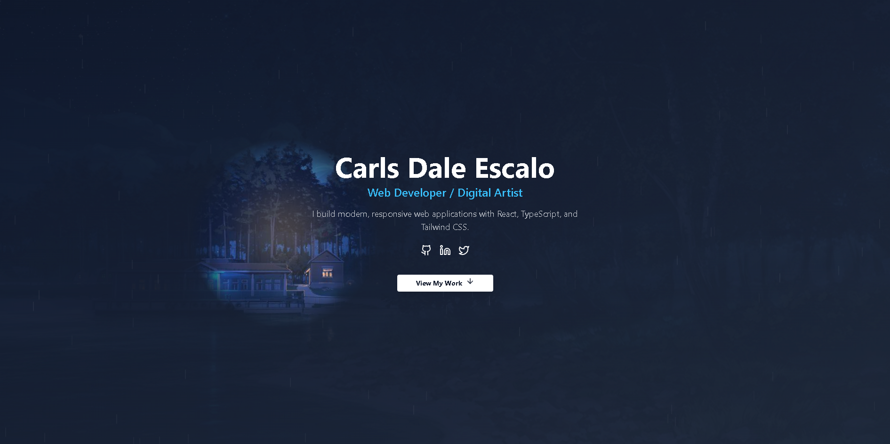
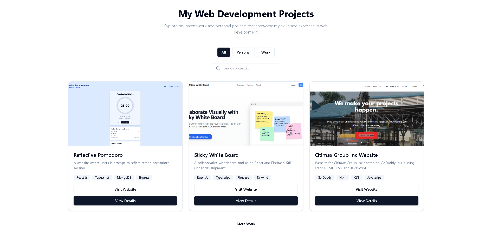
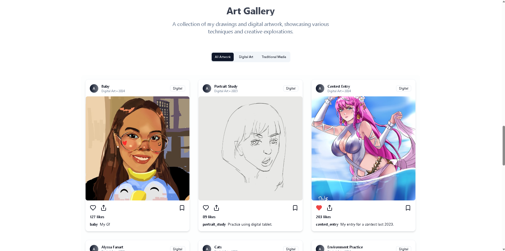
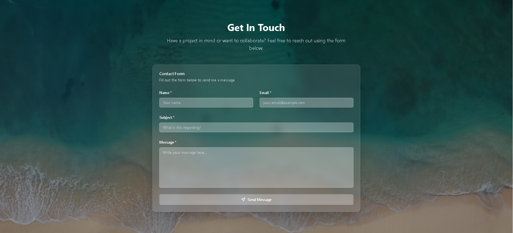

# carlsdaleescalo.com 🌐

[](https://carlsdaleescalo.com)
[](https://github.com/yourusername/carlsdaleescalo.com)
[](https://reactjs.org)
[](https://vitejs.dev)
[](https://www.mongodb.com/)

> Personal portfolio website of Carls Dale Escalo, showcasing web projects, digital artwork, technical skills, and a way to get in touch.

---

## 📸 Live Demo

Check out the website here: [https://carlsdaleescalo.com](https://carlsdaleescalo.com)

**Landing Page:**  


**Portfolio Section:**  


**Art Gallery:**  


**Contact Form:**  


---

## 🏗️ Features

- **🌅 Dynamic Time-Based Theming:** The portfolio automatically detects your local time and applies contextual backgrounds:
  - 🌄 **Morning** (5 AM - 12 PM) - Bright, energetic theme
  - ☀️ **Afternoon** (12 PM - 6 PM) - Warm, professional theme
  - 🌙 **Night** (6 PM - 5 AM) - Elegant, dark theme
  - Manual override available for instant theme switching and testing

- **Landing Page:** Clean, interactive introduction with animated gradient text and real-time responsive design.

- **Portfolio:** Showcase of web projects with detailed descriptions, links, and modal previews.

- **Skills & Technologies:** Comprehensive display of technical expertise and tools used.

- **Art Gallery:** Interactive digital art exhibition with smooth carousel and modal views.

- **Smart Assistant:** Integrated chatbot for enhanced user interaction and support.

- **Get in Touch:**
  - Contact form connected to **MongoDB**
  - Real-time input validation
  - Secure form submissions
  - Automated confirmation emails
  - Owner notifications for new inquiries

- **Performance Optimized:** Vite-powered fast development and production builds with lazy loading and SEO optimization.

---

## 🛠️ Technologies Used

**Frontend:**
- React 18 with Hooks and Context API
- TypeScript for type safety
- Vite for lightning-fast builds
- Tailwind CSS for responsive design
- Framer Motion for smooth animations
- Lucide React for beautiful icons

**Backend/API:**
- Node.js with Express.js
- RESTful API architecture

**Database:**
- MongoDB for data persistence
- Secure credential management

**Features & Tools:**
- NodeMailer for email notifications
- Real-time form validation
- Context API for global state management
- SEO utilities for metadata and schema markup
- Security utilities for XSS prevention and sanitization

---

## 🚀 Getting Started

### Prerequisites
- Node.js (v16 or higher)
- npm or yarn package manager

### Installation

1. **Clone the repository:**
   ```bash
   git clone https://github.com/wardslarc/carlsdaleescalo.com.git
   cd carlsdaleescalo.com
   ```

2. **Install dependencies:**
   ```bash
   npm install
   ```

3. **Set up environment variables:**
   Create a `.env.local` file in the root directory:
   ```
   VITE_API_URL=your_api_endpoint
   VITE_MONGODB_URI=your_mongodb_connection_string
   ```

4. **Start the development server:**
   ```bash
   npm run dev
   ```

5. **Build for production:**
   ```bash
   npm run build
   ```

---

## ✨ Key Features Explained

### Dynamic Theme System
The portfolio features an intelligent theming system that automatically adapts to the user's local time:

- **Automatic Detection:** Uses JavaScript's `getHours()` to detect the current time
- **React Context API:** Global state management ensures theme consistency across all components
- **Manual Override:** Users can manually switch themes via the options menu (Sparkles button)
- **Persistent State:** Manual selections persist throughout the browsing session

### Smart Conversation Assistant
An integrated chatbot providing:
- Real-time user assistance
- Natural language interaction
- Seamless integration with the options menu

### Security & Performance
- XSS prevention utilities
- Input sanitization
- SEO-optimized metadata
- Lazy loading for images and components

---

## 📁 Project Structure

```
src/
├── components/
│   ├── HeroSection.tsx          # Main landing with dynamic backgrounds
│   ├── ChatBot.tsx              # AI assistant with options menu
│   ├── ProjectsSection.tsx      # Portfolio projects showcase
│   ├── SkillsSection.tsx        # Technical skills display
│   ├── ArtSection.tsx           # Digital art gallery
│   ├── ContactSection.tsx       # Contact form
│   └── ui/                      # Reusable UI components
├── context/
│   └── ThemeContext.tsx         # Global theme state management
├── lib/
│   ├── security.ts              # Security utilities
│   └── utils.ts                 # Helper functions
├── utils/
│   └── seoUtils.ts              # SEO optimization utilities
└── App.tsx                      # Main application component
```

---

## 🔧 Configuration

### Theme Configuration
Theme settings are defined in `HeroSection.tsx`:
- Morning: 5 AM - 11:59 AM
- Afternoon: 12 PM - 5:59 PM
- Night: 6 PM - 4:59 AM

### Tailwind CSS
Custom Tailwind configuration in `tailwind.config.js` for design consistency.

---

## 📝 Contributing

Contributions are welcome! Please feel free to submit pull requests or open issues for any improvements.

---

## 📄 License

This project is personal and proprietary. Please respect the copyright notice.

---

## 🤝 Connect

- **Website:** [carlsdaleescalo.com](https://carlsdaleescalo.com)
- **GitHub:** [@wardslarc](https://github.com/wardslarc)
- **LinkedIn:** [Carls Dale Escalo](https://www.linkedin.com/in/carls-dale-escalo-797701366/)
- **Twitter:** [@daleonigiri](https://x.com/daleonigiri)

---

**Made with ❤️ by Carls Dale Escalo**